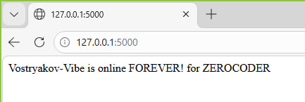

Проект по контейнеризации веб-сервиса на Python/Flask, выполненный в рамках настройки среды **Windows + WSL 2 + Docker Desktop**.
# 🐳 Flask App Containerization

Демонстрационный проект по упаковке Flask-приложения в Docker-контейнер.

### 🚀 Как запустить:
1. Собрать образ: `docker build -t my-flask-app .`
2. Запустить контейнер: `docker run -d -p 5000:5000 my-flask-app`

### 🛠 Технологии:
- **Python / Flask**
- **Docker** (оптимизированный образ на базе python:3.10-slim)

---

## 📋 О проекте
Этот репозиторий — результат успешного развертывания изолированного приложения в Docker-контейнере. Проект прошел путь от первичной настройки ядра WSL до рефакторинга структуры приложения.

### Технологический стэк:
*   **Окружение:** Windows 10/11, WSL 2 (Ubuntu/Debian)
*   **Оркестрация:** Docker Desktop (Engine running ✅)
*   **Язык:** Python 3.9-slim (Linux-based image)
*   **Фреймворк:** Flask

---

## 🛠 Структура файлов проекта

### 1. main.py (Сердце приложения)
```python
from flask import Flask
app = Flask(__name__)

@app.route('/')
def hello():
    # Статус-фраза для проверки доступности
    return "Vostryakov-Vibe is online FOREVER!"

if __name__ == '__main__':
    # Слушаем все интерфейсы (0.0.0.0) для связи с хостом Windows
    app.run(host='0.0.0.0', port=5000)

## Удаление контейнера
docker rm -f vpe02-containedocker rm -f vpe02-container  
## Создание контейнера
docker build -t vpe02-app .
## Запуск контейнера
docker run -d -p 5000:5000 --name vpe02-container vpe02-app
